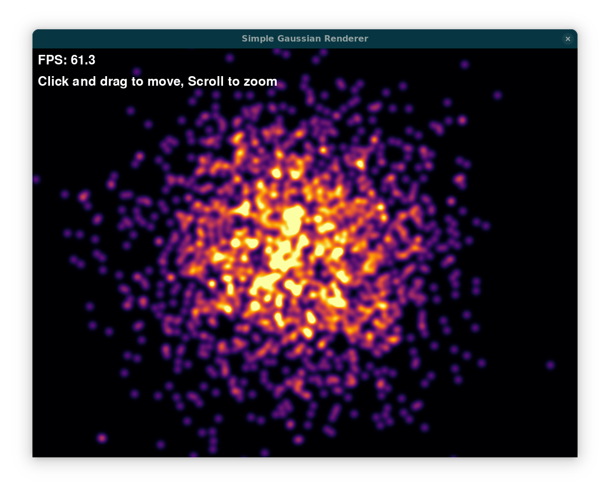

# Gaussian Renderer

A JAX-based project for rendering 2D Gaussians with interactive visualization.



## Overview

This project implements two different methods for rendering 2D Gaussian distributions:

1. **Simple Gaussian Renderer**: A direct computation approach that calculates the full Gaussian function for each point. This provides a mathematically precise but computationally intensive implementation.

2. **Fast Gaussian Renderer**: An optimized approach using splatting and blur passes, capable of handling many more Gaussians efficiently.

## Features

- Real-time interactive rendering
- Mouse-based camera navigation (pan and zoom)
- Inferno colormap visualization
- Hardware-accelerated computation using JAX
- Resizable window support
- FPS display

## Requirements

- Python 3.8+
- JAX
- NumPy
- Pygame
- Matplotlib (for colormap)

## Installation

### Using Nix:
```
nix develop .#with_cuda
```

### Using conda:
```
conda env create -f environment.yml
conda activate gaussian-renderer
```

## Running
```
python src/simple_gaussian_renderer.py
```
