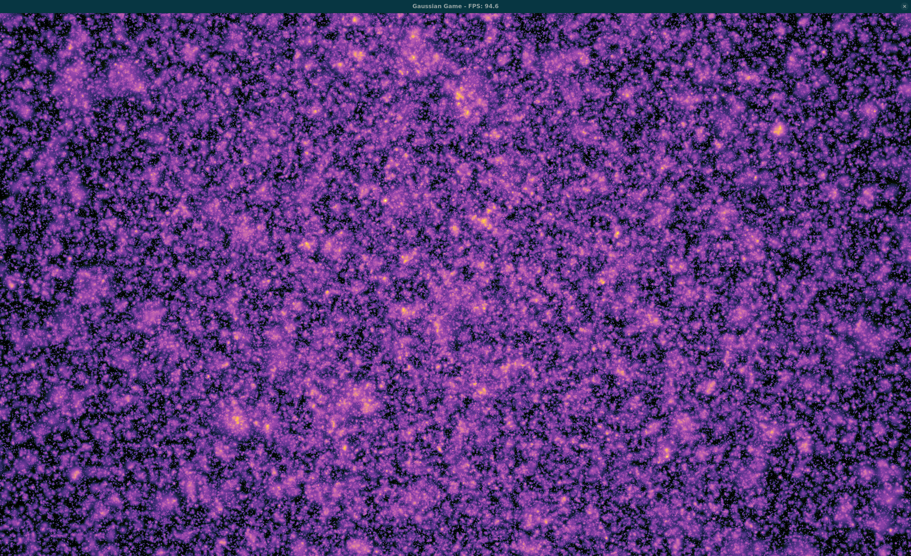

# Gaussian Racer

A WebGPU-based real-time 2D gaussian mixture renderer written in Python.



## Features
- Real-time rendering of 2D gaussian mixtures
- Interactive camera controls with dynamic gaussian under cursor
- Cross-platform support (Linux, macOS)
- Hardware-accelerated rendering using WebGPU
- Two-pass rendering with colormap visualization
- Smooth blending of overlapping gaussians

## Installation

Install Nix using the Determinate Systems installer:
```bash
curl --proto '=https' --tlsv1.2 -sSf -L https://install.determinate.systems/nix | sh -s -- install
```

## Quick Start
```bash
# Run directly from GitHub
nix run github:bmabsout/gaussian_racer_jax/webgpu

# Or clone and run locally
git clone https://github.com/bmabsout/gaussian_racer_jax
cd gaussian_racer_jax
nix run

# Development shell
nix develop
```

## Controls
- Mouse drag: Pan camera
- Mouse wheel: Zoom in/out
- Mouse cursor: Interactive gaussian component
- Hold Shift: Add gaussian at cursor position

## Architecture
- WebGPU for GPU-accelerated rendering
- GLFW for window management
- Two-pass rendering pipeline:
  1. Gaussian accumulation with additive blending
  2. Colormap visualization for height field
- Platform-agnostic design (Vulkan on Linux, Metal on macOS)

## Development
After entering the development shell:
```bash
python src/gaussian_game.py
```

## License
[MIT License](LICENSE)
